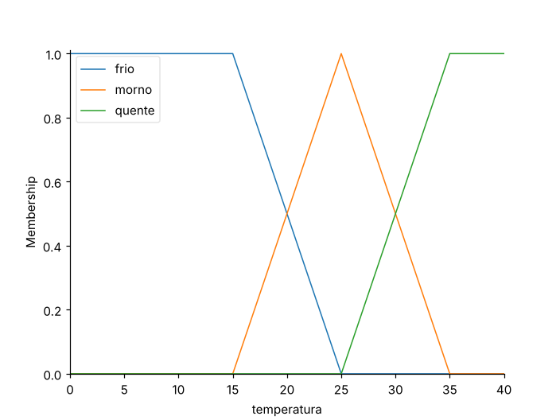
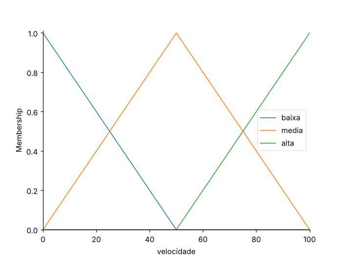
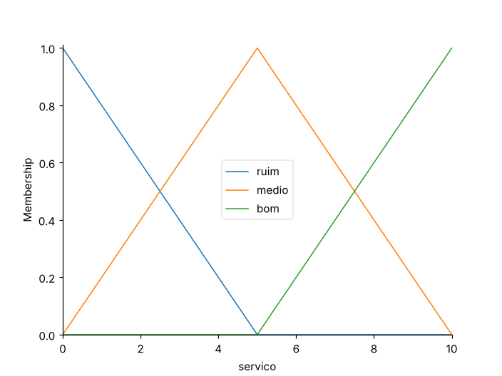
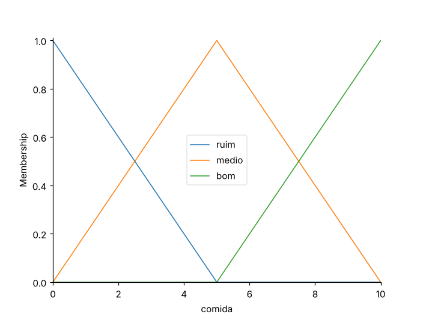
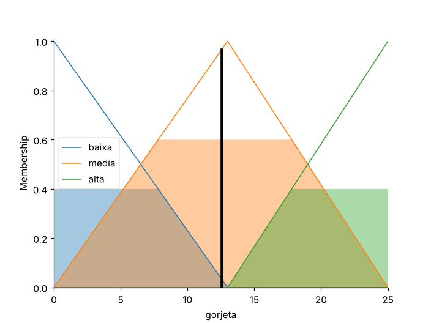
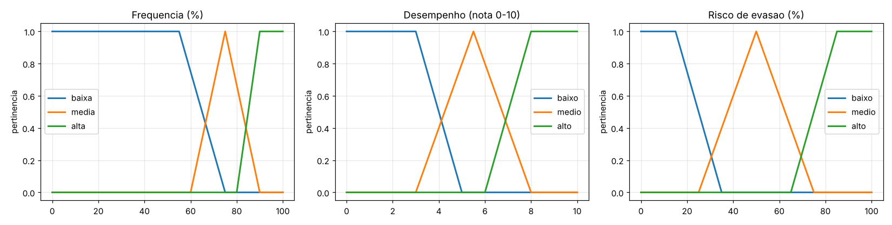

# resultados - aula 09 (AC-3 Sprint 1 - Lógica Fuzzy)

Aluno: Matheus Dantas | Turma ECO.8NA | Data: 07/10/2026

## O que a lógica fuzzy realiza

Na lógica clássica uma afirmação é verdadeira ou falsa: 20 °C é "quente" (1) ou não é (0). A lógica fuzzy troca isso por um grau de verdade entre 0 e 1. No lab 01, 20 °C é 0,5 "frio" e 0,5 "morno" ao mesmo tempo. Com isso o sistema trabalha com termos vagos ("morno", "serviço bom") em vez de um corte exato tipo `if temp > 30`.

O caminho é o do diagrama do material da aula:

```
[01 Entrada crisp] -> [02 Fuzzificação] -> [03 Inferência] <- [04 Regras SE-ENTÃO]
                                                  |
[06 Saída crisp]  <-  [05 Defuzzificação (centroide)]
```

1. **Fuzzificação:** transforma o valor medido em graus de pertinência (20 °C → frio 0,5; morno 0,5).
2. **Regras:** SE-ENTÃO ligam os termos de entrada aos de saída (SE frio ENTÃO velocidade baixa). E usa o mínimo, OU usa o máximo.
3. **Inferência:** cada regra corta o termo de saída na altura da sua força de disparo, e as áreas cortadas são unidas (máximo).
4. **Defuzzificação:** a área resultante vira um número só. Aqui foi usado o centroide.

Quando duas regras disparam juntas, a saída fica entre as duas. Por isso a velocidade ou a gorjeta mudam de forma gradual e não aos saltos.

## Justificativa da modelagem

### Limites do universo do discurso

| Variável | Universo | Justificativa |
|----------|----------|---------------|
| Temperatura (lab 01) | 0 a 40 °C | cobre a temperatura ambiente |
| Velocidade do ventilador (lab 01) | 0 a 100 % | percentual da rotação máxima |
| Serviço e comida (lab 02) | 0 a 10 | escala de nota usada no material |
| Gorjeta (lab 02) | 0 a 25 % | faixa de gorjeta usada no material |
| Frequência (lab 03) | 0 a 100 % | presença em aula |
| Desempenho (lab 03) | 0 a 10 | escala de nota |
| Risco de evasão (lab 03) | 0 a 100 % | percentual de risco |

### Triangulares vs trapezoidais

No lab 03, e na temperatura do lab 01, os termos das pontas são trapézios e o termo do meio é triângulo.

- **Trapézio nas pontas** (frequência baixa, desempenho alto, risco alto...): no platô a pertinência fica em 1 por uma faixa inteira. Por exemplo, frequência baixa vale 1 de 0 a 55 %. Perto da borda do universo o valor é totalmente aquele termo.
- **Triângulo no meio** (frequência média, desempenho médio, risco médio): a pertinência só é 1 no valor típico e cai para os dois lados.
- Termos vizinhos se sobrepõem, então todo valor do universo pertence a pelo menos um termo e a saída muda de forma gradual.

## Lab 01 - Ventilador fuzzy

### Resultado

```
10°C -> ventilador a 17%
20°C -> ventilador a 44%
25°C -> ventilador a 50%
30°C -> ventilador a 56%
38°C -> ventilador a 83%
```




## Lab 02 - Gorjeta

### Resultado (valores padrão: serviço 7, comida 3)

```
=> Gorjeta sugerida: 12.5%
```





### Experimentos

```
===== EXPERIMENTOS =====
base (7,3)                       : 12.55%
1) regra 2 com E (7,3)           : 12.55%
2) servico trapezoidal (7,3)     : 13.59%
2) servico gaussiano (7,3)       : 11.99%
3) defuzzificacao centroid (7,3) : 12.55%
3) defuzzificacao bisector (7,3) : 12.58%
3) defuzzificacao mom (7,3)      : 12.75%
4) com 'excelente' (7,3)         : 12.55%
5) (0,0)                         : 4.33%
5) (10,10)                       : 21.00%
5) (5,5)                         : 12.67%
```

**1) Regra 2 com `servico["medio"] & comida["medio"]`:** para (7, 3) o resultado não mudou (12,55%). Serviço 7 e comida 3 têm o mesmo grau em "médio", 0,6. Então min(0,6; 0,6) = 0,6, a mesma força que a regra tinha só com o serviço.

**2) Trapézios e gaussianas no serviço:** com trapézios a gorjeta foi para 13,59%, e com gaussianas para 11,99%. As gaussianas deixam as curvas do serviço sem quinas, com a passagem de um termo para o outro gradual. Os trapézios criam platôs, onde a pertinência fica constante em 1. Só com o ponto (7, 3) não dá para dizer se a saída ficou mais suave. O que muda de forma visível é o formato das curvas.

**3) Métodos de defuzzificação:** centroid deu 12,55%, bisector 12,58% e mom 12,75%. Centroid e bisector usam a área inteira. O mom é a média dos pontos onde a área agregada é máxima (0,6, o corte da regra 2 no triângulo "média"). Esses pontos vão de 8,0 a 17,5 no universo da gorjeta, e a média deles é 12,75.

**4) 4º conjunto "excelente":** `servico["excelente"] = fuzz.trimf(servico.universe, [8, 10, 10])`. Regra nova: **SE serviço excelente ENTÃO gorjeta alta**. Para (7, 3) o resultado não mudou (12,55%), porque serviço 7 tem grau 0 em "excelente".

**5) (0,0), (10,10) e (5,5):** 4,33%, 21,00% e 12,67%. A ordem é a esperada: a menor gorjeta sai em (0,0) e a maior em (10,10). Os extremos não chegam a 0% e 25% porque, com uma regra só ativa, a saída é o centroide de um triângulo:

| Caso | Regra ativa | Centroide |
|------|-------------|-----------|
| (0,0) | só "baixa" | (0+0+13)/3 = 4,33 |
| (10,10) | só "alta" | (13+25+25)/3 = 21,00 |
| (5,5) | só "média" | (0+13+25)/3 = 12,67 |

## Lab 03 - Sistema fuzzy próprio: risco de evasão de aluno

### Etapa 1 - Definição do problema

O problema é calcular o risco de um aluno abandonar a disciplina. Hoje quem acompanha isso é o professor e a coordenação, a partir das faltas e das notas. As entradas são a **frequência** (% de presença) e o **desempenho** (nota média de 0 a 10), e a saída é o **risco de evasão** (0 a 100 %). Fuzzy é adequado porque nenhuma das entradas tem um limite exato: 74% de presença não é muito diferente de 76%, mas um `if freq < 75` trataria os dois de forma oposta. E o caso difícil é a combinação das duas (muita falta com nota boa, ou presença boa com nota ruim), que as regras SE-ENTÃO descrevem diretamente.

### Etapa 2 - Modelagem

| Variável | Termo | Função |
|----------|-------|--------|
| Frequência (%) | baixa | trapézio [0, 0, 55, 75] |
| | média | triângulo [60, 75, 90] |
| | alta | trapézio [80, 90, 100, 100] |
| Desempenho (nota 0-10) | baixo | trapézio [0, 0, 3, 5] |
| | médio | triângulo [3, 5.5, 8] |
| | alto | trapézio [6, 8, 10, 10] |
| Risco de evasão (%) | baixo | trapézio [0, 0, 15, 35] |
| | médio | triângulo [25, 50, 75] |
| | alto | trapézio [65, 85, 100, 100] |

Base de regras:

| # | Regra |
|---|-------|
| R1 | SE frequência baixa E desempenho baixo ENTÃO risco alto |
| R2 | SE frequência baixa E desempenho médio ENTÃO risco alto |
| R3 | SE frequência baixa E desempenho alto ENTÃO risco médio |
| R4 | SE frequência média E desempenho baixo ENTÃO risco alto |
| R5 | SE frequência média E desempenho médio ENTÃO risco médio |
| R6 | SE frequência média E desempenho alto ENTÃO risco baixo |
| R7 | SE frequência alta E desempenho baixo ENTÃO risco médio |
| R8 | SE frequência alta E (desempenho médio **OU** desempenho alto) ENTÃO risco baixo |

A base cobre as 9 combinações de frequência × desempenho.



### Etapa 3 - Implementação

`lab03_aula09.py`, só com NumPy e Matplotlib: fuzzificação (`mu`), regras (`REGRAS`, E = `min`, OU = `max`), corte e união das áreas, e centroide (`inferir`).

### Etapa 4 - Testes

```
 freq  nota |  risco | obtido | esperado | resultado
   95   9.0 |  13.14 | baixo  | baixo    | OK  (aluno assiduo e com notas altas)
   50   2.0 |  86.86 | alto   | alto     | OK  (faltoso e com notas baixas)
   75   5.5 |  50.00 | medio  | medio    | OK  (no limite de presenca e nota mediana)
   92   3.0 |  50.00 | medio  | medio    | OK  (assiduo, mas com notas baixas)

4/4 casos dentro do esperado
```

Faixas usadas para comparar a saída com a resposta esperada: baixo abaixo de 33, médio de 33 a 66 e alto acima de 66.
